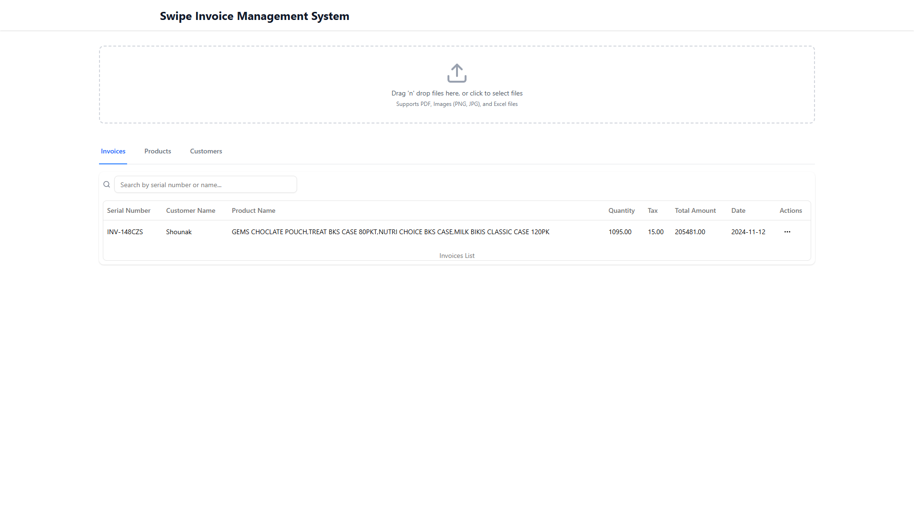
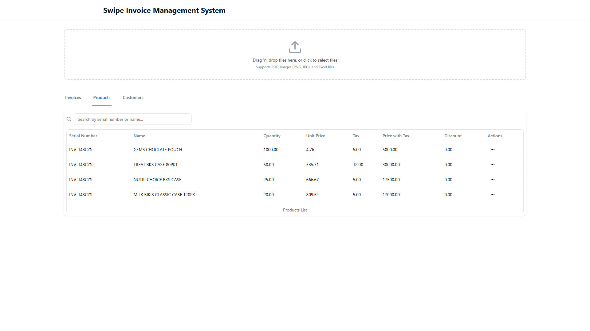
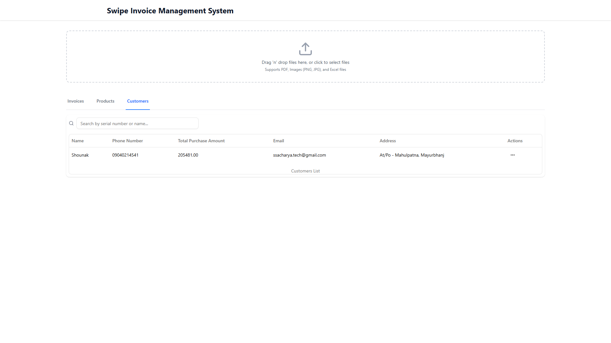

# Swipe - Automated Data Extraction and Invoice Management system


## 📋 Overview

Swipe is a React application that automates the extraction, processing, and management of invoice data from various file formats (Excel, PDF, and images). The application organizes extracted data into three main sections - Invoices, Products, and Customers - and maintains real-time synchronization across tabs using Redux for consistent updates.

## ✨ Features

- **AI-Powered Extraction**: Utilize Google Gemini API to intelligently extract data from multiple file formats
- **Multi-Format Support**: Process Excel files, PDFs, and images with a unified extraction solution
- **Organized Data Views**: View and manage data across three synchronized tabs
- **Real-Time Synchronization**: Changes in any tab are instantly reflected across the application
- **Validation & Error Handling**: Comprehensive validation with user-friendly error messaging
- **Responsive Design**: Clean, intuitive interface built with shadcn/ui and Tailwind CSS

## 🛠️ Tech Stack

- **Frontend Framework**: ReactJs
- **Build Tool**: Vite
- **Language**: TypeScript
- **State Management**: Redux Toolkit
- **UI Components**: shadcn/ui
- **Styling**: Tailwind CSS
- **AI Integration**: Google Gemini API

## 📸 Screenshots

### Invoices Tab


### Products Tab


### Customers Tab


## 🚀 Live Demo

Check out the live demo: [Swipe App](https://swipe-invoice-management-system.netlify.app/)

## 🧪 Test Cases

The application successfully handles all the given test cases:

### Case 1: Invoice PDFs
- **Input**: PDF invoices
- **Result**: Successfully extracted all invoice details, products, and customer information
- **Screenshot**: [Case 1 Result](./screenshots/test%20cases/case1/invoices.png)

### Case 2: Invoice PDFs + Images
- **Input**: Mixed format of PDF invoices and image-based invoices
- **Result**: Successfully extracted data from both formats using the Gemini Vision API
- **Screenshot**: [Case 2 Result](./screenshots/test%20cases/case2/invoices.png)

### Case 3 & 4: Excel Files
- **Input**: Excel files with transaction details
- **Result**: Correctly parsed structured data into the three data categories
- **Screenshot**: [Case 3 & 4 Result](./screenshots/test%20cases/case3&4/invoices.png)

### Case 5: All Types of Files
- **Input**: Combination of Excel, PDF, and image files
- **Result**: Successfully handled mixed input types with a unified extraction approach
- **Screenshot**: [Case 5 Result](./screenshots/test%20cases/case5/invoices.png)

### Missing Information Handling
- When required fields were missing (especially in Case 3), the application highlighted the missing fields and prompted for completion
- **Screenshot**: [Missing Fields Handling](./screenshots/MissingFieldsHandling.png)

## 📊 Data Structure

The application organizes data into three main entities:

### Invoices
- Serial Number
- Customer Name
- Product Name
- Quantity
- Tax
- Total Amount
- Date

### Products
- Name
- Quantity
- Unit Price
- Tax
- Price with Tax
- Discount 

### Customers
- Customer Name
- Phone Number
- Total Purchase Amount
- Email
- Address

## 🧠 AI Integration

The application uses Google Gemini API for intelligent data extraction:

- **Document Processing**: Extracts structured data from PDFs using Gemini's document understanding capabilities
- **Image Processing**: Processes images of invoices using Gemini's vision capabilities
- **Excel Processing**: Parses and extracts tabular data from Excel files, mapping structured information to the appropriate data entities
- **Data Classification**: Intelligently categorizes extracted information into the appropriate data models
- **Entity Recognition**: Identifies and extracts key entities such as amounts, dates, product details, and customer information

## 🔄 State Management

Redux Toolkit is used to maintain a centralized state for consistent data handling:

- **Store Structure**: Organized by entities (invoices, products, customers)
- **Real-time Sync**: Changes in any tab are immediately reflected across the application


## Error Handling
* The system checks data at multiple stages (upload, processing, and data entry)
* Clear error messages pinpoint issues and suggest solutions
* When files are missing required information, the app highlights these fields and prompts users to complete them manually


## 🚀 Getting Started

### Prerequisites
- Node.js 
- npm or yarn

### Installation

1. Clone the repository
```bash
git clone https://github.com/ssacharya2002/Swipe-Invoice-Management-System
cd Swipe-Invoice-Management-System
```

2. Install dependencies
```bash
npm install
# or
yarn
```

3. Set up environment variables
```bash
cp .env.example .env
```
Edit `.env` file and add your Gemini API key:
```
VITE_GEMINI_API_KEY=your_gemini_api_key_here
```

4. Start the development server
```bash
npm run dev
# or
yarn dev
```

5. Open [http://localhost:5173](http://localhost:5173) in your browser


